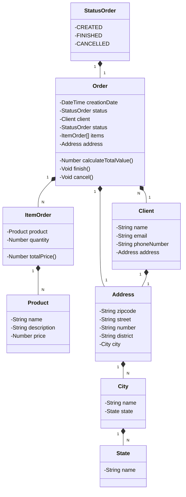

# Challenge Railway Java API

RESTful API de um sistema básico de e-commerce

## 👨‍💻️ Tecnologias utilizadas

O projeto foi desenvolvido utilizando as seguintes tecnologias
- [Java 17](https://www.oracle.com/java/technologies/downloads/?er=221886#java17): Versão amplamente utilizada
- [Spring Boot 3](https://spring.io/projects/spring-boot): Maximiza a produtividade do desenvolvedor por meio de sua poderosa premissa de autoconfiguração
- [Spring Data JPA](https://spring.io/projects/spring-data): Simplificar a camada de acesso aos dados, facilitando a integração com bancos de dados SQL
- [OpenAPI (Swagger)](https://www.openapis.org/): documentação de API eficaz e fácil de entender usando a OpenAPI (Swagger), perfeitamente alinhada com a alta produtividade que o Spring Boot oferece
- [Railway](https://railway.app/): Facilita o deploy e monitoramento de nossas soluções na nuvem, além de oferecer diversos bancos de dados como serviço e pipelines de CI/CD.

## ✏️ Sobre

O desafio entregue se trata de um **E-commerce** básico que tem a finalidade de cadastrar as entidades de seu contexto: 
**Produto, Cliente, Pedido, Cidade e Estado** além de emitir os pedidos com a possibilidade de incluir e remover intens, tabém alterar os seus estados: **FINISHED e CANCELLED**

## Diagrama de Classes (Domínio da API)

## Documentação da API (Swagger)

### [https://sdw-2023-prd.up.railway.app/swagger-ui.html](https://sdw-2023-prd.up.railway.app/swagger-ui.html)

Esta API ficará disponível no Railway por um período de tempo limitado

---
Desenvolvido por Thiago Basilio no Bootcamp DIO Santander 2024 Back End Java 🚀️ 